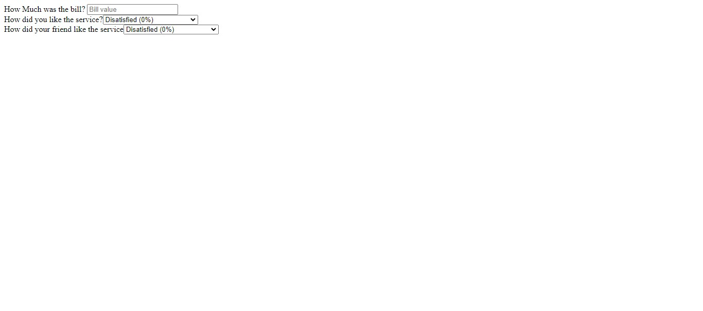

# Tip Calculator App
This is a simple tip calculator app built in React. It uses React state to store and track the State. Users input their bills and have option input to select how satsified they are with the service, Upon that they can see the total bills calculated.Main practise case is Statemanagement

# Getting Started
1.To run the app, you will need to have Node.js and NPM installed. 

2.Once you have those installed, you can clone the repo:-

https://github.com/Emmanuel687/Tip-Calculator.git

3.After cloning the repo run the following commands:

npm install
npm start

4.This will start the app in development mode. You can then open the app in your browser at http://localhost:3000.

# Images

# Features
1.A user can input his/her bill

2.A user can rate how he/she has liked the service.

3.A user can rate how he/her colleague feels the service is.

4.A user can see the total bill plus tip.

# Learning Objective
1.Managing and Tracking State within a components.

2.Lifting up state from children to parent component.

3.Using events in react, onClick and onChange.

4.The && operator in Use.

5.Resetting State in React.

6.Children Props in React and Reusing Component.

# Author
This app was created by Emmanuel Koech.

# License
This app is licensed under the MIT License 2023.
